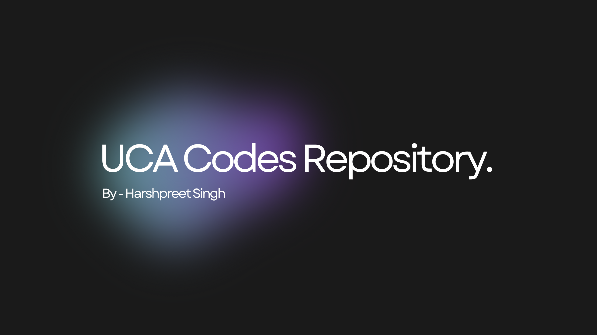

# UCA Codes Repository

Welcome to my repository for all the UCA Codes I have written. This collection includes various algorithms, data structures, and system calls implemented in C. Dive in to explore and use these codes for your learning and development!

## Table of Contents

- [Introduction](#introduction)
- [Features](#features)
- [Getting Started](#getting-started)
- [Contact](#contact)

## Introduction

This repository contains a collection of C programs, including data structures, sorting algorithms, memory management techniques, and system calls. Each piece of code is well-documented and can be used as a reference for understanding the fundamental concepts of computer science.

## Notion Notes

[](https://harshpreet931.notion.site/C_Programming-4f4c37edcb794b49a43182b106ea6f1f?pvs=4)

## Features

- **Data Structures:** Implementations of stacks, pointers, and bits.
- **Algorithms:** Various sorting algorithms.
- **System Calls:** Examples of system-level programming.
- **Utility Programs:** Programs for binary search, random number generation, and time measurement.

## Getting Started

To get a local copy of the repository, clone it using Git:

```bash
git clone https://github.com/harshpreet931/UCA_Codes.git

Ensure you have a C compiler like gcc installed on your machine to compile and run the programs.
```

## Contact

Feel free to reach out if you have any questions, suggestions, or just want to connect!

### Harshpreet Singh

[](https://github.com/harshpreet931)
[](https://www.linkedin.com/in/harshpreet931)
